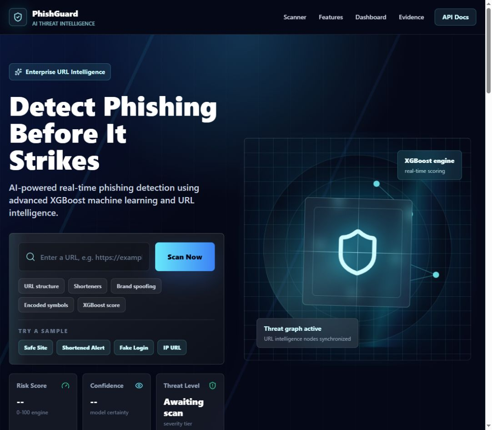
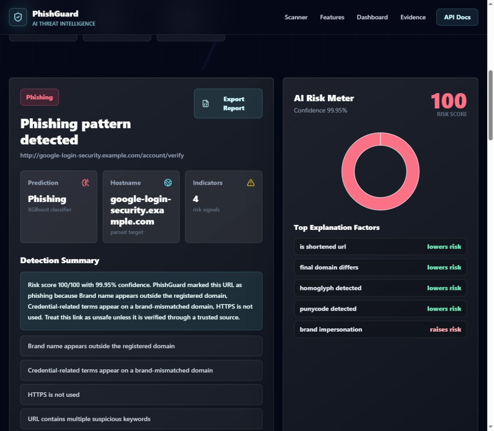

# PhishGuard

PhishGuard is a full-stack URL phishing-risk assessment system developed for a UTAR Final Year Project. It combines a 73-feature URL representation, a saved XGBoost classifier, contextual risk rules, available threat-feed evidence, and a React interface.

The system provides an on-screen risk assessment. It does not automatically block URLs, and it should not be treated as complete proof that a webpage is safe.



## Project results

| Evaluation | Scope | Samples | Accuracy | Precision | Phishing recall | F1-score |
| --- | --- | ---: | ---: | ---: | ---: | ---: |
| Internal model evaluation | Saved XGBoost classifier before contextual and threat processing | 60,231 | 94.30% | 97.61% | 90.83% | 94.10% |
| External pipeline validation | URL processing, feature extraction, XGBoost, contextual and threat evidence, final verdict | 890 | 95.73% | 93.10% | 99.80% | 96.33% |

Additional verified outcomes:

- 418,540 balanced modelling URLs after cleaning and deduplication
- 73 engineered URL features
- Hostname-grouped 70:15:15 split with zero hostname overlap across the outer partitions
- Decision threshold 0.48, selected from validation predictions after training
- 499 of 500 phishing URLs detected in the external completed-pipeline validation
- 30 of 30 automated functional and security-related tests passed
- Frontend production build passed

The internal and external figures are not directly comparable. The internal result evaluates the classifier on the held-out modelling test set. The external result evaluates the completed prediction pipeline on a smaller independent URL collection.

## Result and explanation interface



The result screenshot uses a synthetic `example.com` demonstration URL. The interface presents the verdict, threat level, risk score, confidence, detected indicators, explanation factors, scan history, dashboard summaries, and JSON report export.

## System workflow

```mermaid
flowchart LR
    A[User submits URL] --> B[React frontend]
    B --> C[FastAPI backend]
    C --> D[URL validation and processing]
    D --> E[73-feature extraction]
    E --> F[Saved scaler and feature order]
    F --> G[XGBoost prediction]
    G --> H[Contextual and threat evidence]
    H --> I[Risk assessment and response]
    I --> J[History and dashboard]
```



Supporting components include the saved XGBoost model, scaler, feature order, local threat-feed snapshots with optional remote fallback, and SQLite or PostgreSQL storage.

## Why XGBoost

XGBoost was selected as the final implemented classifier because it suits structured numerical URL features, supports regularisation and probability-based threshold adjustment, and provides feature-importance output. The project does not claim that XGBoost is universally superior to SVM or Random Forest.

The final system threshold is 0.48. It was selected using validation data only, preferring recall of at least 0.92, a false-positive rate no higher than 0.03, and the strongest precision among thresholds meeting those conditions. The final test set was used only after threshold selection.

## Main capabilities

- URL validation and preprocessing
- Seventy-three lexical, structural, contextual, encoding, obfuscation, and optional network-related features
- XGBoost probability prediction using saved training artifacts
- Context-aware risk assessment and available threat-feed evidence
- Safe, Low Risk, Suspicious, High Risk, and Phishing severity levels
- Human-readable indicators and explanation factors
- Scan history, dashboard filters, and JSON result export
- Local/private-network URL blocking, API rate limiting, and security headers
- Optional DNS/WHOIS lookup and shortened-URL expansion with timeouts and SSRF controls

## Technology stack

| Layer | Technologies |
| --- | --- |
| Frontend | React, Vite, Tailwind CSS, Framer Motion, Recharts |
| Backend | FastAPI, SQLAlchemy, Pydantic |
| Machine learning | XGBoost, scikit-learn, pandas, NumPy, joblib |
| Storage | SQLite locally, PostgreSQL for container deployment |
| Deployment | Docker, Docker Compose, Render configuration |
| Testing | pytest, FastAPI TestClient, frontend bundle checks |

## Repository structure

```text
backend/app/                  FastAPI application and prediction services
backend/ml/train.py           Training and evaluation workflow
backend/ml/artifacts/         Final saved model, scaler, feature order, and metrics
backend/ml/data/              Placeholder for local datasets and threat-feed files
frontend/src/                 React interface
tests/                        API, feature, regression, and frontend checks
docs/images/                  Genuine interface screenshots used in this README
FINAL_MODEL_REPORT.md         Detailed modelling and evaluation record
Dockerfile                    Full-stack container image
docker-compose.yml            Application and PostgreSQL deployment
render.yaml                   Render deployment configuration
```

Raw training datasets, local scan-history databases, virtual environments, caches, logs, and frontend build output are intentionally excluded from Git. The final trained model artifacts required for prediction are included.

## Run locally on Windows

Requirements:

- Python 3.11
- Node.js and npm

```powershell
git clone https://github.com/jiayiii0/phishguard.git
cd phishguard

python -m venv .venv
.\.venv\Scripts\python.exe -m pip install --upgrade pip
.\.venv\Scripts\python.exe -m pip install -r requirements.txt

cd frontend
npm.cmd ci
npm.cmd run build
cd ..

$env:PYTHONPATH=(Get-Location).Path
.\.venv\Scripts\python.exe -m uvicorn backend.app.main:app --host 127.0.0.1 --port 8000
```

Open `http://127.0.0.1:8000`.

The SQLite database is created automatically when the application starts. New users do not need the developer's local `phishguard.db` file.

## Run the tests

```powershell
$env:PYTHONPATH=(Get-Location).Path
.\.venv\Scripts\python.exe -m pytest -q
```

Expected frozen-submission result:

```text
30 passed
```

## Docker deployment

```bash
docker compose up --build
```

Open `http://127.0.0.1:8000` after the containers start.

## Configuration

| Variable | Default | Purpose |
| --- | --- | --- |
| `DATABASE_URL` | Local SQLite file | Select SQLite or PostgreSQL storage |
| `ENABLE_SHAP` | `false` | Enable optional SHAP explanations |
| `ENABLE_NETWORK_INTEL` | `false` | Enable live DNS/WHOIS checks |
| `ENABLE_SHORTENER_EXPANSION` | `false` | Resolve supported shortened URLs |
| `ENABLE_THREAT_FEED_LOOKUP` | `true` | Use available threat-feed evidence |
| `URL_RESOLVE_TIMEOUT_SECONDS` | `1.5` | Network resolution timeout |
| `CORS_ORIGINS` | Local application origins | Restrict browser origins |
| `PHISHTANK_APP_KEY` | Empty | Optional PhishTank application key |

FastAPI's interactive API documentation is available at `http://127.0.0.1:8000/docs` while the backend is running.

## Reproducing or retraining the model

The checked-in artifacts represent the frozen final model. Raw datasets are excluded because they are large and may contain active phishing URL strings.

The training workflow supports local CSV data and download helpers for PhishTank, Phishing.Database, OpenPhish, UCI-style data, and a legitimate URL dataset. Input CSV files must contain `url` and `label` columns, where `1` represents phishing and `0` represents legitimate.

```powershell
$env:PYTHONPATH=(Get-Location).Path
.\.venv\Scripts\python.exe -m backend.ml.train --balance --cv-folds 3
```

Training replaces the saved artifacts under `backend/ml/artifacts`. Preserve the frozen artifacts before running a new experiment.

## Limitations

- Complex legitimate URLs can still produce false positives.
- URL-level evidence cannot confirm the safety of webpage content.
- Threat feeds may be incomplete, unavailable, or ambiguous on shared-hosting platforms.
- Alerts remain inside the web interface; the system does not automatically block URLs or send external notifications.
- The project did not conduct a formal end-to-end latency, concurrent-load, or scalability benchmark.
- The tested controls and 30 passing tests do not establish complete security.

## Related publication

The related paper, **“Phishing Website Detection Using Machine Learning: A Comparative Evaluation of SVM, Random Forest, and XGBoost,”** was accepted by ICOCO 2026.

The paper's comparative benchmark is separate from the frozen PhishGuard system evaluation. Its datasets, thresholds, and results must not be substituted for the system results reported above.

## Responsible use

PhishGuard is an academic risk-assessment project. Do not open suspected malicious URLs during testing. Submit URLs as text, use controlled samples, and verify important decisions through trusted security sources.
